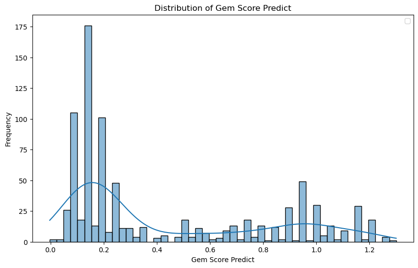

# 💼 Yelp Hidden Gems 识别项目报告  
**Project Report: Discovering Hidden Gems on Yelp**

## 📂 项目概览 | Project Overview

本项目旨在从 Yelp 商家数据中识别“宝藏商家”（Hidden Gems），即那些评分高但关注度低、极具潜力的优质店铺。通过初步聚类、分类模型训练、人工规则打分与回归建模，最终输出一份精细化的宝藏打分（gem_score）和推荐结果。

> This project aims to identify "hidden gems" on Yelp — businesses with high potential that are underappreciated. The pipeline includes clustering, classification modeling, rule-based scoring, and final regression-based gem_score computation.

## 🧪 第一阶段：分类建模 | Phase 1: Classification

- **目标**：将聚类中被人为挑选的 cluster1 商家作为正类，训练分类器识别类似商家。
- **使用模型**：
  - Logistic Regression（带 SMOTE 采样与 class_weight）
  - Random Forest（class_weight）
  - XGBoost（scale_pos_weight 调整）

📈 模型表现对比如下图所示（文件：`model_performance.png`）：  
| 模型               | Accuracy | Precision（1类） | Recall（1类） | F1（1类） | 备注                         |
|--------------------|----------|------------------|---------------|-----------|------------------------------|
| Logistic Regression | 0.957    | 0.80             | 0.98          | 0.88      | 表现最保守，但 Recall 很强     |
| Random Forest       | 0.992    | 0.97             | 0.98          | 0.976     | 全面优秀，泛化能力好           |
| XGBoost             | 0.995    | 0.98             | 0.99          | 0.986     | 表现最佳，预测稳定、精准       |

> We trained LR, RF, and XGBoost classifiers to identify gem-like businesses, with class imbalance handled using sampling or weighting techniques.

**源文件**：`classification.ipynb`

## 📊 第二阶段：人工规则打分与回归建模 | Phase 2: Scoring + Regression

- **目标**：用人工规则构建可解释性得分作为监督信号，训练回归模型拟合“宝藏程度”。
- **人工打分逻辑**（节选）：
  - 星级低于均值或评论数高于均值 → `score = 0`
  - 星级 ≥ 4.5 且评论数 ≤ 25% → `score = 1.0`
  - cat_score、attr_score 作为加分项（支持突破 1.0 上限）

- **模型使用**：XGBoost Regressor  
- **输出**：每个商家的连续 gem_score 分数，分布图如下（文件：`distribution_gem_score.png`）：

> We manually labeled businesses with rule-based scores and trained an XGBoost regressor to predict gem_score for ranking.

**源文件**：`regression.ipynb`

## ✅ 结果输出 | Final Outputs

1. 📄 **`cluster1_scores_all.csv`**：包含所有商家的最终 gem_score 结果（含排序）
2. 🌟 **`gem_candidates_final.csv`**：与原人工标注的 135 家商家交集后留下的 Top 82 个宝藏商家（得分降序）

> The final gem candidates include 82 businesses that were both in the original handpicked gems and the top-ranked by the regression model.

## 📌 项目亮点 | Highlights

- 🤖 分类 + 回归双模型结合，避免硬判别失真
- 🎯 人工规则分层打分，实现了“宝藏程度”的细粒度刻画
- 📊 回归结果分布良好，可用于推荐与排序系统
- 🧩 模型输出与人工结果重叠度达 60%+，表明 gem_score 学到真实语义

