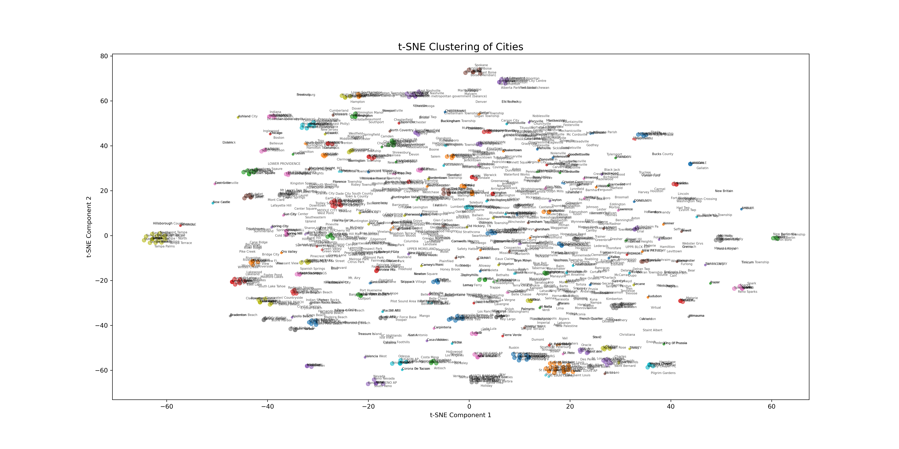

# Filtering the Yelp Dataset: Methodology and Implementation

## Introduction

The Yelp dataset is a comprehensive collection of business-related information, encompassing over 150,000 businesses, nearly 7 million reviews, and approximately 200,000 images across 11 metropolitan areas citeturn0search1. While this dataset offers extensive insights, its vastness presents challenges for processing and analysis, especially when computational resources are limited. To address this, we adopted a city-based filtering approach to manage data volume effectively.

## Data Visualization and Initial Analysis

To inform our filtering strategy, we conducted a series of visual analyses, documented in `city_filter/data_processing.ipynb`. These analyses included:

- **Monthly Distribution of Reviews**: Examined to understand temporal trends in user engagement.

- **Distribution of Businesses Across U.S. States**: Assessed to identify states with the highest business concentrations.

- **Top 20 Cities by Business Count**: Identified urban centers with the densest business activities.

- **Business Distribution by Country**: Analyzed to compare international representation within the dataset.

- **Global Heatmap of Business Locations**: Utilized geospatial data to visualize business density worldwide.

These visualizations provided critical insights into the dataset's structure and guided our subsequent data selection process.

[text](world_business_map(1).html)

## Standardizing City Names

During our analysis, we encountered inconsistencies in city name representations, such as variations like "St. Petersburg" versus "Saint Petersburg," differences in capitalization, spacing issues, and extraneous characters. To address these discrepancies, we implemented a normalization procedure:

1. **Embedding City Names**: Employed a pre-trained embedding model to generate vector representations for all unique city names

2. **Calculating Semantic Similarities**: Computed cosine similarity scores between city name embeddings to quantify their semantic relatedness.

3. **Hierarchical Clustering**: Applied agglomerative clustering using a distance threshold of 0.2 to group semantically similar city names.

4. **Creating a Mapping Dictionary**: Established a mapping from alias city names to standardized names based on clustering results.

This process, detailed in `city_filter/city_visualize.ipynb`, culminated in the visualization `city_clustering.png`, illustrating the clustering outcomes.

## Results of City Name Normalization

Post-normalization, we generated several key datasets:

- **`cities_business_count.csv`**: Lists each city alongside its corresponding business count prior to normalization.

- **`cities_review_count.csv`**: Details the number of reviews associated with each city before normalization.

- **`cities_count.csv`**: Combines business and review counts for each city pre-normalization.

Corresponding files prefixed with `city_` represent the post-normalization data. Notably, the number of unique city entries decreased from 1,416 to 983 after normalization, reflecting the consolidation of duplicate and variant city names.

## Selection of Indianapolis for Focused Analysis

To facilitate the application of Graph Neural Networks (GNNs) and manage computational demands, we selected Indianapolis as our focal city based on:

1. **Appropriate Data Volume**: Indianapolis encompasses 7,547 businesses and 360,000 reviews, providing a substantial yet manageable dataset.

2. **Economic Significance**: As a prominent urban center, Indianapolis offers representative insights into urban business dynamics.

Utilizing Indianapolis business IDs, we extracted pertinent datasets:

- **`businesses_Indianapolis.csv`**: Contains detailed information on businesses located in Indianapolis.

- **`users_Indianapolis.csv`**: Includes data on users who have interacted with Indianapolis businesses.

- **`reviews_Indianapolis.csv`**: Comprises reviews associated with Indianapolis businesses.

These datasets serve as the foundation for our subsequent analyses and model development.

## Conclusion

By implementing a city-based filtering strategy and standardizing city name representations, we effectively reduced the Yelp dataset's complexity, rendering it more amenable to detailed analysis. Focusing on Indianapolis allows for in-depth exploration of urban business patterns while maintaining computational feasibility.