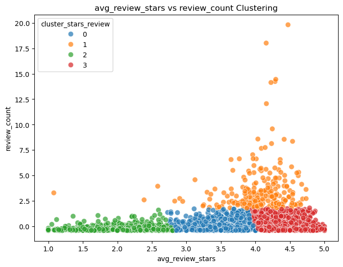
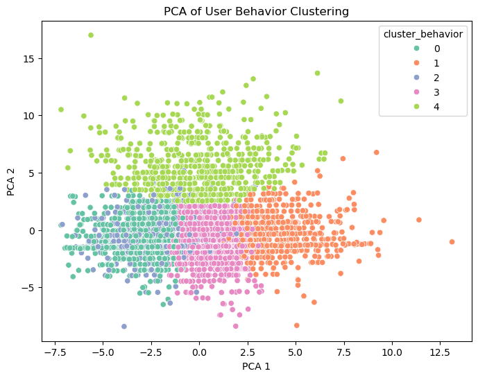
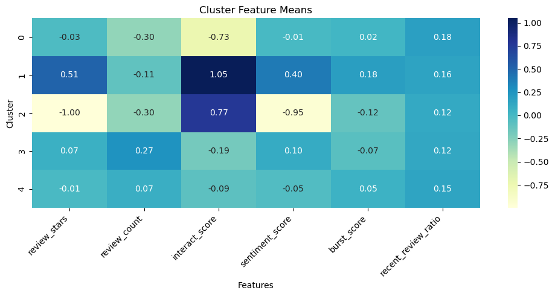
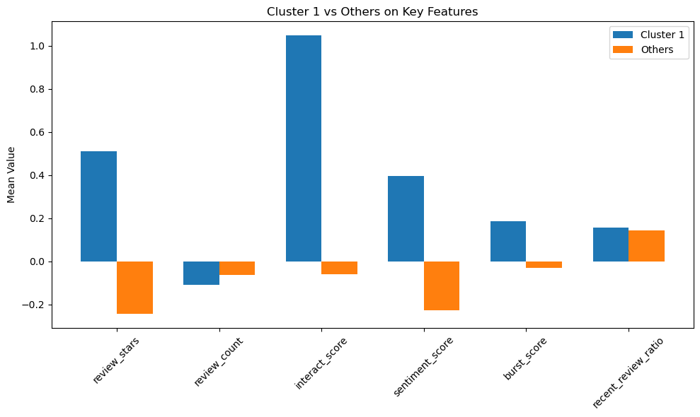
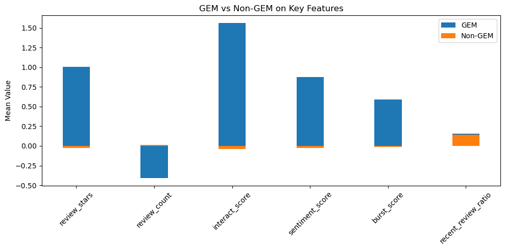

# 🌟 Yelp 商家聚类分析报告 / Yelp Business Clustering Analysis Report

源代码文件 / Source Code: `cluster.ipynb`  
输出文件 / Output File: `gem_candidates.csv`  
中间数据 / Intermediate Data: `cluster_summary.csv`  
可视化图表 / Visualizations:
- `stars_reviews_cluster.png`
- `deep_cluster_PCA.png`
- `cluster1_others.png`
- `cluster_heatmap.png`
- `gem_non-gem.png`

## 📌 目的与思路 / Objective & Methodology

本阶段目标是通过无监督学习方法对商家进行行为聚类，辅助识别 Yelp 数据中被低估的优质商家（Hidden Gems）。  
The goal of this stage is to apply unsupervised learning to cluster businesses by behavior and identify potentially underrated quality businesses in the Yelp dataset.

## 🧩 步骤摘要 / Workflow Summary

### Step 1: 基于评分和评论数的初步聚类  
**聚类特征**：`stars` 与 `review_count`  
- 聚类算法：KMeans (k=4)
- 可视化图：`stars_reviews_cluster.png`  
> 从图中识别出高评分低评论的候选群体。

**Features**: `stars`, `review_count`  
**Clustering algorithm**: KMeans (k=4)  
**Output**: `stars_reviews_cluster.png`  
> This helped highlight businesses with high ratings and low review counts as initial hidden gem candidates.

### Step 2: 基于行为和情感特征的深层聚类  
**剔除字段**：`stars`, `review_count`, 时间戳、ID 等  
**聚类特征**：评论情感、互动量、用户质量、评论密度等行为特征，共约25项  
**聚类方法**：KMeans (k=5)，降维方式：PCA (2D)  
**可视化图**：`deep_cluster_PCA.png`

We removed explicit scoring and volume features and clustered using ~25 behavior-based features (e.g., sentiment, engagement, user quality).  
PCA was used to visualize results in 2D.

### Step 3: 聚类结果分析与对比  
生成五个聚类的行为特征均值表格 `cluster_summary.csv`，并从中识别出评分高、互动强、情感积极的 Cluster 1。  
通过 `cluster1_others.png`、`cluster_heatmap.png` 对该聚类进行深入特征比较。

Averages of each cluster's key indicators were saved to `cluster_summary.csv`.  
Cluster 1 was identified as a strong candidate group for hidden gems.  
Comparative visuals: `cluster1_others.png`, `cluster_heatmap.png`.

### Step 4: 精细筛选宝藏商家并打标签  
在 Cluster 1 内部进一步筛选评分高、互动活跃、情感正向、曝光较少的商家，得到 135 个宝藏商家。  
最终将每个商家打上 `gem_label` 标签（1 = 宝藏商家），保存至 `gem_candidates.csv`。

A refined filter was applied within Cluster 1 to select businesses with:
- High average rating
- Positive sentiment
- High interaction
- Low review volume  
Result: 135 gems labeled in `gem_candidates.csv` with a new column `gem_label`.

### Step 5: 可视化对比宝藏与非宝藏商家  
图表：`gem_non-gem.png`  
显示宝藏商家在评分、情感、互动、爆发度等关键指标上显著优于普通商家。

Bar plot `gem_non-gem.png` compares hidden gems vs. others across multiple key features such as sentiment, interaction, and burst score.

## 📦 输出汇总 / Final Outputs

| 文件名 / Filename | 内容 / Content |
|-------------------|----------------|
| `gem_candidates.csv` | 商家+特征+聚类+gem标签 |
| `cluster_summary.csv` | 5类聚类的关键特征均值 |
| `stars_reviews_cluster.png` | 星级+评论数聚类图 |
| `deep_cluster_PCA.png` | 多特征行为聚类分布图 |
| `cluster1_others.png` | 聚类1 vs 其他类对比图 |
| `cluster_heatmap.png` | 各聚类特征热力图 |
| `gem_non-gem.png` | 宝藏商家 vs 非宝藏对比图 |

## ✅ 下一步建议 / Next Steps

- 将 `gem_label` 用作监督学习标签，构建逻辑回归、随机森林、XGBoost 等模型
- 输出每个商家的 `gem_score`，用于宝藏排序推荐系统
- 构建多模型评估机制（AUC, PR curve）

> 项目阶段目标“发现被低估的优质商家”已通过无监督 + 精细筛选基本完成，下一阶段进入监督建模。

The phase goal of discovering underrated high-quality businesses has been achieved through clustering and refinement. The next step is to model gem_score using supervised learning.

