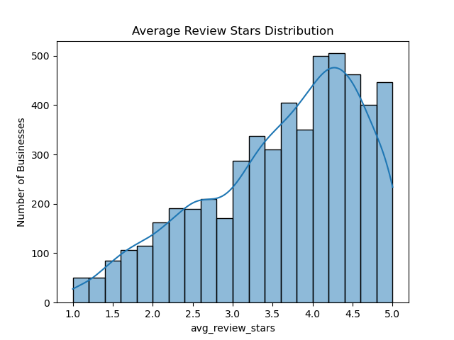
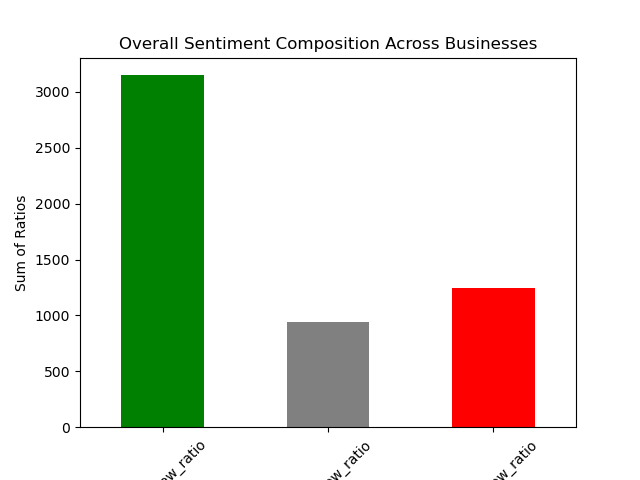

# 评论特征提取报告 | Review Feature Extraction Report

- 📁 源代码 / Source Code: `review_feature.ipynb`  
- 📊 可视化 / Visualization:  
  - `avg_review_stars_distribution.png`（平均评分分布）  
  - `overall_sentiment_composition.png`（评论情感组成）

- 📁 输出/ Output: `business_review_Indianapolis_features.csv`

## 🧠 项目背景 | Background

本阶段旨在从 Yelp 评论数据中提取用于商家识别与质量评估的关键评论特征，为后续的建模与分析（如“被埋没的优质商家识别”）提供结构化输入。

The goal of this phase is to extract key review-level features from Yelp data to support the downstream task of identifying high-quality yet underrated businesses.

## 🔧 数据源与处理 | Data Sources & Processing

- **情感分析数据**：已通过滑动窗口技术对原始评论文本进行处理，并使用情感分类模型输出标签（Very_Negative ~ Very_Positive）
- **原始评论文本数据**：用于提取文本长度、互动性等原始特征
- **商家筛选信息**：仅保留出现在最终商家集合（`business_df`）中的商家

We used two types of review data: sentiment-labeled data and raw text data. Features are aggregated only for businesses listed in our filtered set.

## 🧩 特征提取维度 | Extracted Feature Dimensions

### 1. 🌟 评分特征 | Rating Features

| 特征名 | 描述 |
|--|--|
| `avg_review_stars` | 商家评论星级的平均值 |
| `std_review_stars_scaled` | 商家评分标准差（已标准化） |

> 评分标准差反映用户评价的一致性或分歧，经过标准化处理提升了建模可比性。

The average and variability of review scores were captured. Standard deviation was scaled to unify its magnitude with other numeric features.

### 2. ❤️ 情感特征 | Sentiment Features

| 特征名 | 描述 |
|--|---|
| `sentiment_score_mean_scaled` | 情感得分均值（映射后 [-2, 2]，并标准化） |
| `pos_review_ratio`, `neg_review_ratio`, `neu_review_ratio` | 不同情感占比 |

> 情感标签映射为整数值后求均值，可量化商家整体评论情绪倾向；同时保留不同情感类型的相对占比信息。

Sentiment labels were mapped to integer scores and averaged. The ratio of positive, negative, and neutral comments was also calculated for interpretability.

### 3. ✍️ 内容特征 | Textual Features

| 特征名 | 描述 |
|--|--|
| `avg_review_length_scaled`, `avg_word_count_scaled` | 平均字符数与词数（标准化） |
| `long_review_ratio` | 超过 300 字的长评论占比 |

> 评论长度经过 `log(1+x)` 转换和标准化，控制长尾分布；长评论通常包含更深入的内容。

Comment length features were transformed and scaled to reduce skewness. Long reviews were considered to contain more informative feedback.

### 4. 🙋‍♀️ 互动特征 | Interaction Features

| 特征名 | 描述 |
|--|--|
| `avg_useful_scaled`, `avg_funny_scaled`, `avg_cool_scaled` | 各类互动票数（标准化） |
| `interact_score_mean_scaled` | 自定义加权互动得分（useful + 0.5×funny + 0.2×cool） |

> 互动性反映评论被读者关注和认可的程度，加权方式体现“信息价值 > 情绪驱动”的重要性排序。

The interaction score aggregates user engagement signals with weighted importance. Useful votes dominate, while funny and cool provide secondary indicators.

### 5. 📆 时间特征 | Temporal Features

| 特征名 | 描述 |
|--|---|
| `recent_review_ratio` | 最近一年评论占总评论的比例 |
| `review_timespan_days_scaled` | 评论时间跨度（标准化） |
| `review_density_per_day_scaled` | 平均每日评论密度 |
| `review_burst_score_scaled` | 近期热度爆发度（近期评论比例 / 总跨度天数） |
| `first_review_date`, `last_review_date` | 首/末条评论时间（保留 datetime 格式） |

> 尽管 Yelp 数据集已于 2021 年停更，时间类特征仍提供了商家评论生命周期的关键信息。

Though the Yelp dataset is historical, relative time-based features still capture business activeness and lifecycle trends.

## 📊 可视化图示 | Visualizations

### ⭐ 商家平均评分分布 | Average Star Distribution

### 🧠 评论情感组成 | Overall Sentiment Composition

## ✅ 总结 | Summary

本轮评论特征提取从评分、情感、内容、互动、时间五个维度构建了较为完整的商家评论画像，为后续的冷门优质商家挖掘（GemSeek）任务打下了坚实基础。

This review feature extraction phase constructed a rich set of descriptors capturing multiple aspects of customer feedback. These features will play a critical role in discovering high-quality, underrated businesses.

