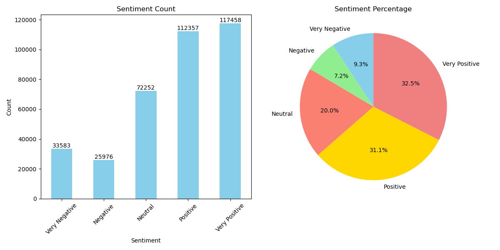

# Text Sentiment Analysis Work Report

## Project Overview

This project aims to perform sentiment analysis on a batch of text data, employing a sliding window approach to handle lengthy texts and utilizing batch processing to enhance model inference efficiency. The source code file is `analyzing.ipynb`

## 1. Environment Setup and Model Loading

- **Device Configuration**: Initially, the availability of a GPU is checked to leverage its capabilities for accelerating model inference.

- **Model and Tokenizer Loading**: The pre-trained model `tabularisai/multilingual-sentiment-analysis` and its corresponding tokenizer are utilized.

## 2. Sliding Window Batch Sentiment Analysis Function

To process texts exceeding the model's maximum length, the `batch_slide_window_sentiment` function is defined. This function segments a list of texts using a sliding window approach and performs sentiment analysis in batches.

## 3. Batch Processing of Text Data and Result Saving

The `analyze_reviews_with_sentiment` function is defined to read text data from an input CSV file, conduct batch sentiment analysis, and save the results to a new CSV file.

## 4. Execution of Sentiment Analysis

By invoking the above functions, sentiment analysis is performed on the specified input file, and the results are saved to `reviews_Indianpolis_analyzed.csv`.

## 5. Results and Summary

Through the aforementioned steps, the text data in the `reviews_Indianpolis.csv` file has been successfully analyzed for sentiment, with the results saved in `reviews_Indianpolis_analyzed.csv`.

**Sample Results**:

| Original Text (text)           | Analyzed Sentiment Label |
|--------------------------------|--------------------------|
| This product is amazing!       | Very Positive            |
| I am not satisfied with the service. | Negative                |

**The distribution of sentiment**:

This process effectively handles long texts using the sliding window method and enhances model inference efficiency through batch processing, providing a viable solution for large-scale text sentiment analysis.